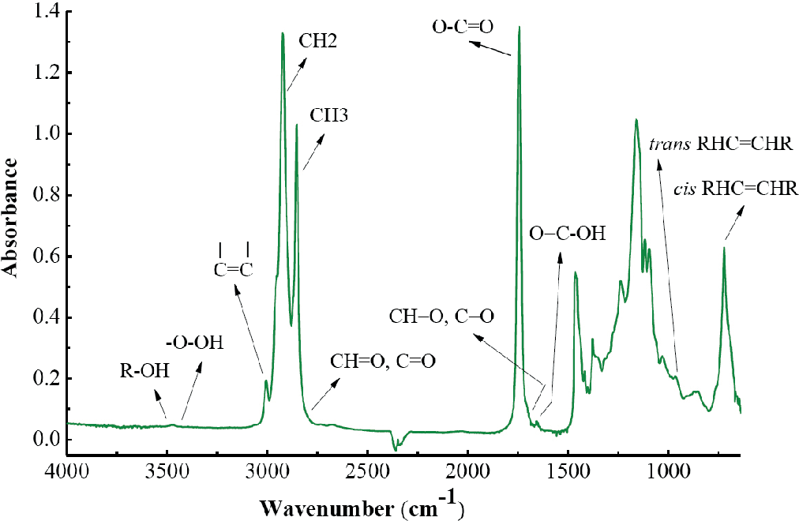
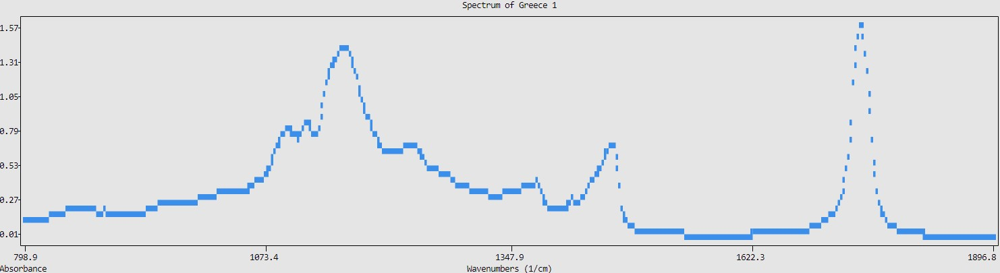
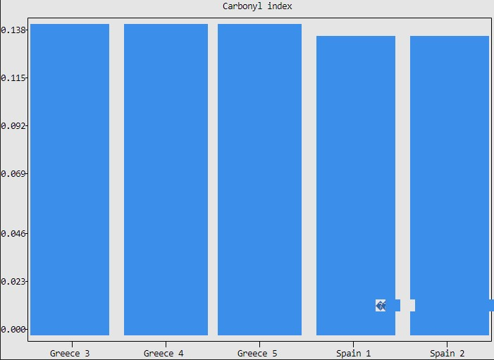
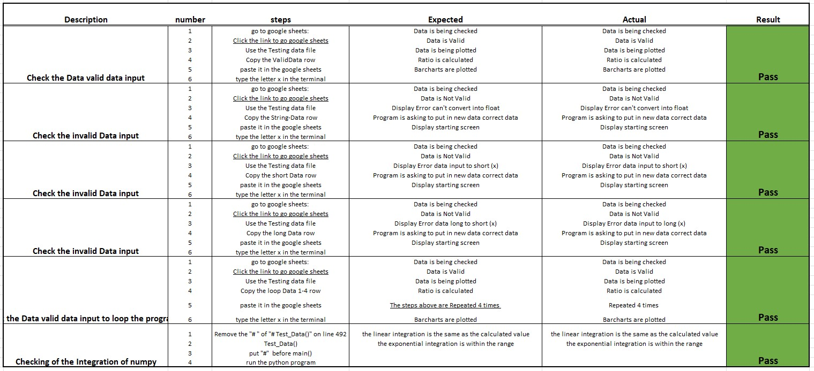

<h1>Data-Integration-template</h1>
This project was created in order for QC(quality control) labs or students to easily keep track of their products. It will allow them to keep track of certain chemical information about their products as well as update them using an easy to use google sheets API. this example has been made to check different type of olive oils.

an FTIR(Fourier transform infrared) spectrum of olive oil with attributed band is displayd. a change in spectrum can appear depending of the olive oil itself.

<h2>Site Goals</h2>

This is a simple application to give user a template to quickly modify and quickly keep track of their data and do data manipulation on them

<h2>User Guide</h2>

A quick user guide can be found on google sheet documents using the following link

<a href="https://docs.google.com/document/d/15TESpf-30ibR4NBzRKcN6XyxgjuNqkzDge-6oaH0oxI/edit?usp=sharing" target = "_blank">Link to User Guide</a>

<h2>Target Audience</h2>

students or QC labs to have an user friendly way to do manipilation and keep track of the chemical data of their products

<h2>User Stories</h2>

<li>As a User, I would like to be able to easily input my data in a well know 
environment which requires no/minimal training to use</li>
<li>As a User, I would like to be able to check all the data steps because this could be important in case of audit or check for mistakes</li>
<li>As a User, I would like to be able to visualize my acquired Data</li>
<li>As a User, I would like to be able to visualize my acquired Data to see certain trends</li>
<li>As a User, I would like to be able to process my acquired Data in a quick way</li>
<h3>Features Planned</h3>

<li>Simple easy to use application using a familiar environment</li>
<li>Simple storage of the data</li>
<li>Visualization of the data</li>
<li>data manipulation to give more information to the user</li>
<li>looking for trends of the last data set to see changes</li>
<h2>Structure</h2>

<h3>USER STORY</h3>
<ol>
<li>As a User, I would like to be able to easily input my data in a well know 
environment which requires no/minimal training to use</li>
</ol>

<h3>IMPLEMENTATION</h3>
<li>API to google sheets</li>

excel is a familiar environment for many user so it will be an ideal place to do this.

Also a userguide is provided(<a href="https://docs.google.com/document/d/15TESpf-30ibR4NBzRKcN6XyxgjuNqkzDge-6oaH0oxI/edit?usp=sharing" target="_blank">Link to User Guide</a>)

<li>The user will put the data as required in this application in the google sheets Raw_Data file</li><a href="https://docs.google.com/spreadsheets/d/1cEWBDHZ35fzQ320SUUwLCcgsBtijk0C3keXW9kgA0Uc/edit#gid=0" target="_blank">link to input file</a>

in case a wrong data has been imported they will get a notification to alter it and the application won't run. 
it will ask you to put in new data and will check it again when you press "x"in the application

<li>when the data has been input they just need to press "x" to run the application</li>

if the data is valid the application will run completly

<h3>USER STORY</h3>

As a user, I would like to be able to to visualize my acquired Data

<h3>IMPLEMENTATION</h3>

<li>plotting of the data that has been added to google sheets file using PloText library</li>

once the programme starts running after the data check it will plot the spectrum data

<h3>USER STORY</h3>
<li>data manipulation to give more information to the user</li>
<li>As a User, I would like to be able to check all the data steps because this could be important in case of audit or check for mistakes</li>
<h3>IMPLEMENTATION</h3>
<li>the NumPy libary has been used to integrate the data using trap integration</li>

the Data was tested using https://www.integral-calculator.com/ and integration by hand. The function Test_Data() was used

Only a slight difference could be observed between the resulst so this is a valaible option for this kind of application because also don't have actual function to describe the spectrum so an approximation of the integrated value will be calculated(<a href= "https://en.wikipedia.org/wiki/Trapezoidal_rule" target="_blank">More information</a>)

<li>Integration of certain chemical vibrations to determine the presence of oxygenated groups and the branching of the olive oils</li>

The integrations borders can be changed in the top of the program for flexibility

<li>Afterwards the integrated data is added to the Integrated_Data sheet for to see the actual integrated values</li>

this is very important to check your data and for audit purposes because the all steps can be traced back

<li>Afterwards the Ratio Calculation are made to look at the ratio between the CH2 groups and the oxynated groups</li>

<li>This will be displayed in table format</li>

<h3>USER STORY</h3>
<li>looking for trends of the last data set to see changes</li>

<h3>IMPLEMENTATION</h3>
<li>the last 5 values will be plotted to look for the change/trend in the final samples</li>
<li>The PloText libary is used to plot the barcharts for each ratio to see a trend</li>

<h3>USER STORY</h3>

As a user, I would like to be able to to visualize my acquired Data

<h3>IMPLEMENTATION</h3>

<li>A loop was created to check how many new spectra were added afterwards it will loop through all the new added spectra but it has limitions due to the API which has a query limit(see more of bug fixes) between 3-10 are able to be analyzed at once. Important do not at more then 10 new spectra in go to the data set this will increase the chance of crashing. the data has been tested until 10 samples only sometimes a crash occured when putting in 10 spectra</li>

<h3>Error Handling</h3>

Error handling was implemented throughout the application with the use of try/except statements to handle exceptions raised for things like, NaN values, wrong data input for example if the data input has to many values or to little values

API quota problems for this reasons it was opted to have a 10 second delay of the count per sample. to limit this issue

<h3>Features Left to Implement</h3>
As a future enhancement, I would like to add some basic functionality to have an input using an excell file that would be unloaded and read for a more easy input. Secondly instead of writing out into the terminal it would beneficial to have output in pdf.

<h2>Logical Flow</h2>

flow-chart of application:

<h2>Technologies</h2>
<ul>
<li>Python</li>

Python was the main language used to build the application.

Python packages used:

<ul>
<li>NumPy library for data integration</li>
<li>PloText library for graph plotting in the terminal</li>
<li>API to google scheets for user input</li>
<ul>
<li>Gspread</li>
<li>google.oauth2.service_account</li>
</ul>
<li>Time packages was imported to slow down the code for 10 second to not overload the API</li>
</ul>
<h2>Testing</h2>

<h3>Pep8 Validation</h3>

All python code was ran through pep8online.com validator and any warnings or errors were fixed. Code then validated successfully.

In gitpod, warning was displayed by linter that string statement has no effect at line 6 but this is mainly used for documentation.
Unuses variables because this function give 4 output and is different variables are used in different functions but all variables are used. So this warning is ignored.

<h3>Bugs and fixes</h3>

problem with the values of the data integration due to , seperator for values bigger then a thousand. a fix was implemented so the , seperator was removed so it could be converted into floats.

<h3>unfixed bugs</h3>
Due to the problem of using the API the loop function is maximum amount ranging from 3-10 depending how on external factors such as the changes you did in the file. 
this is limitation through using a free API. it has a Requests per 100 seconds per user limit. 

<h2>Deployment</h2>
<h3>Version Control</h3>
The site was created using the Visual Studio code editor and pushed to github to the remote repository ‘history’.

The following git commands were used throughout development to push code to the remote repo:

git add <file> - This command was used to add the file(s) to the staging area before they are committed.

git commit -m “commit message” - This command was used to commit changes to the local repository queue ready for the final step.

git push - This command was used to push all committed code to the remote repository on github.

<h3>Heroku Deployment</h3>
The below steps were followed to deploy this project to Heroku:
<ul>
<li>Go to Heroku and click "New" to create a new app.</li>
<li>Choose an app name and region region, click "Create app".</li>
<li>Go to "Settings" and navigate to Config Vars. Add the following config variables:</li>
<li>PORT : 8000</li>
<li>Navigate to Buildpacks and add buildpacks for Python and NodeJS (in that order).</li>
<li>Navigate to "Deploy". Set the deployment method to Github and enter repository name and connect.</li>
<li>Scroll down to Manual Deploy, select "main" branch and click "Deploy Branch".</li>
<li>The app will now be deployed to heroku</li>
<li><a source ="" target="_blank">ToDolink</a></li>
 </ul>

<h3>Clone Locally</h3>
<ul>
<li>Open IDE of choice and type the following into the terminal:</li>
<li>git clone xxx</li>
<li>Project will now be cloned locally.</li>
<li>Open your IDE of choice (git must be installed for the next steps)</li>
<li>Type git clone copied-git-url into the IDE terminal</li>
<li>The project will now of been cloned on your local machine for use.</li>
</ul>
<h3>Credits</h3>

<h5>StackOverflow</h5>

was used for certain bug fixes which were encounterd during the programming process so could find what the problem was and give guidance on solution

<h5>Core Science Resources(<a href="https://csr.quadram.ac.uk/example-datasets-for-download/">link</a>)</h5>

the used spectra for this applications were obtained by Henri S. Tapp, Marianne Defernez, and E. Katherine Kemsley

<h5>Code insitute</h5>

the code insitute curriculum was used to develop the entire application. Mainly the love-sandwiches project was great inspiration to find out how to connect the file to google sheets.<a href="github.com/Code-Institute-Solutions/love-sandwiches">link</a>

